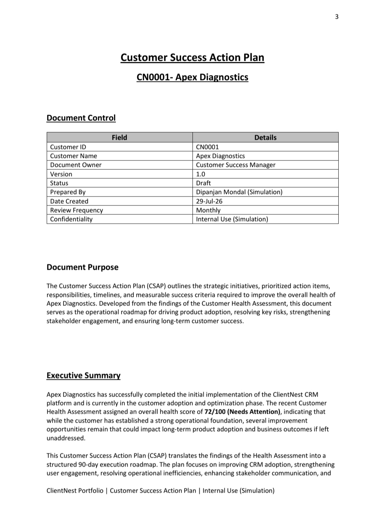
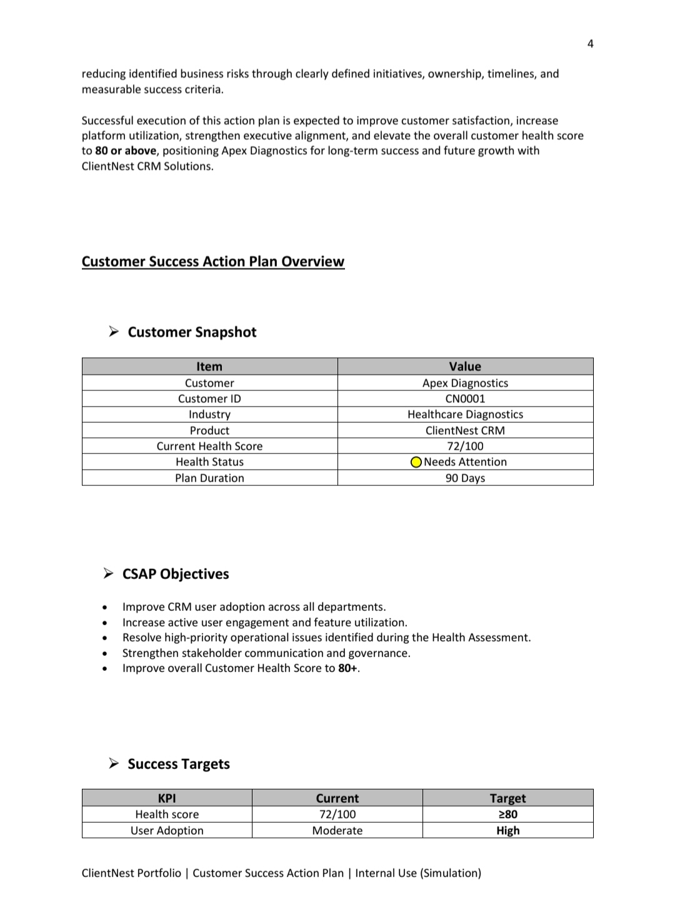
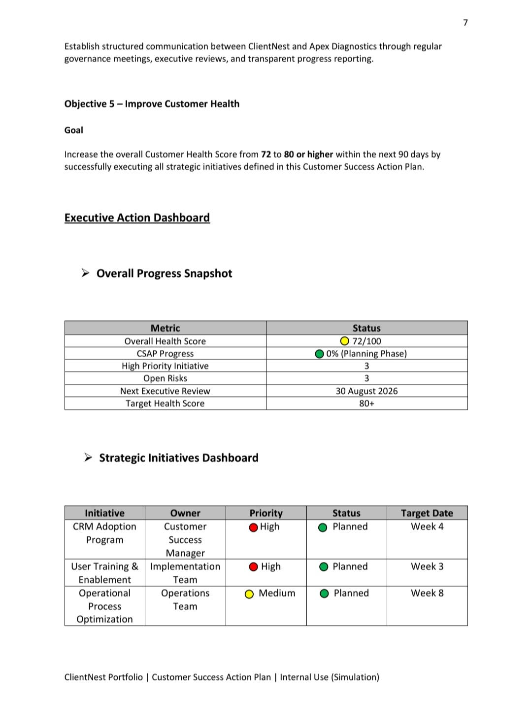
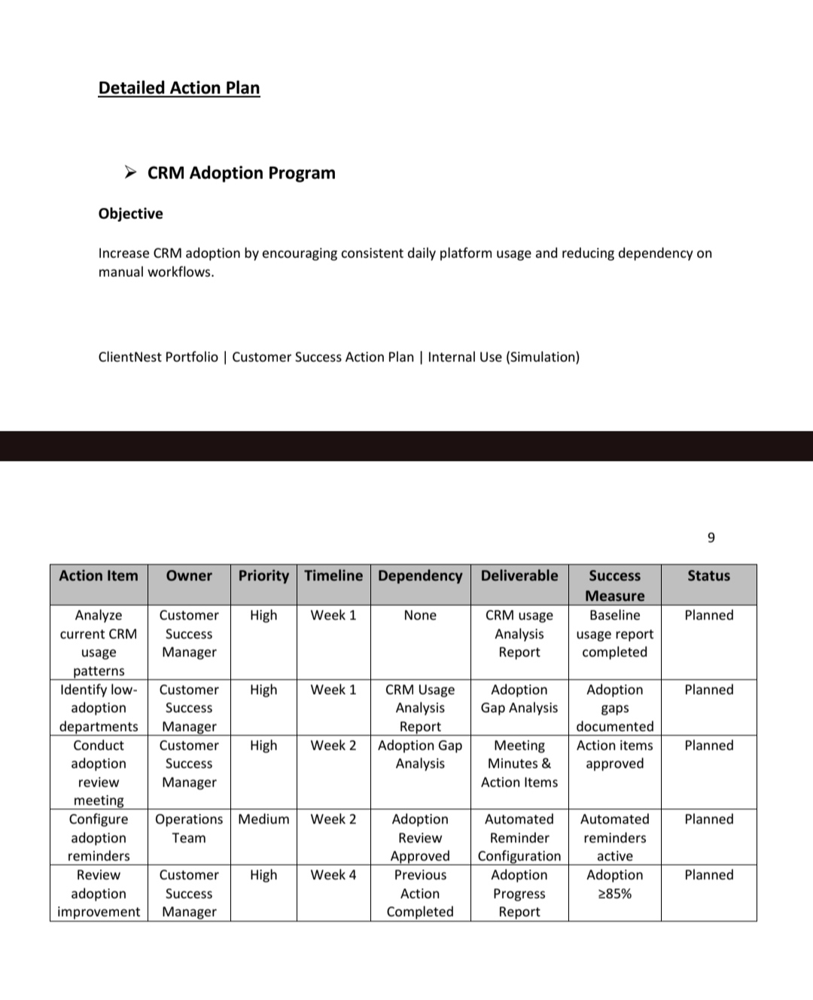
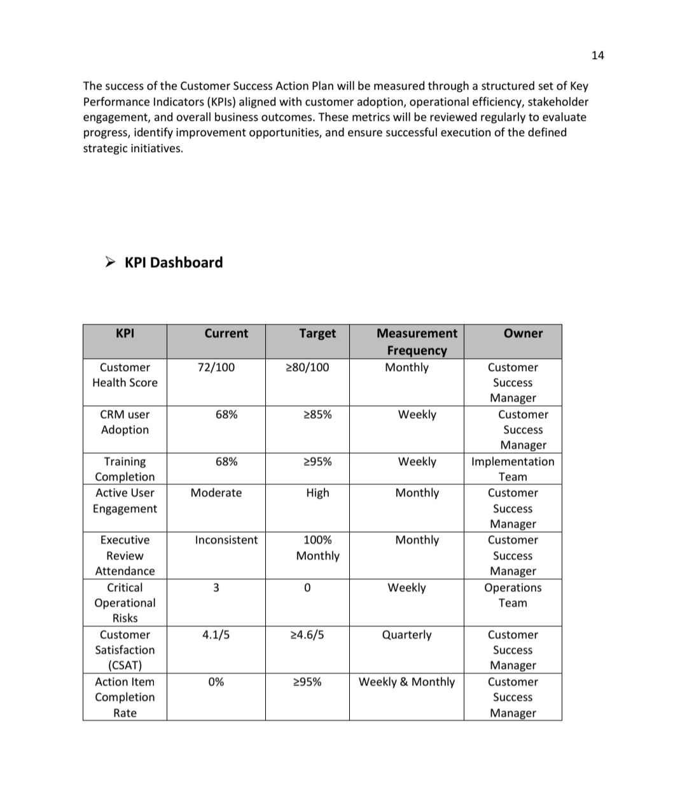
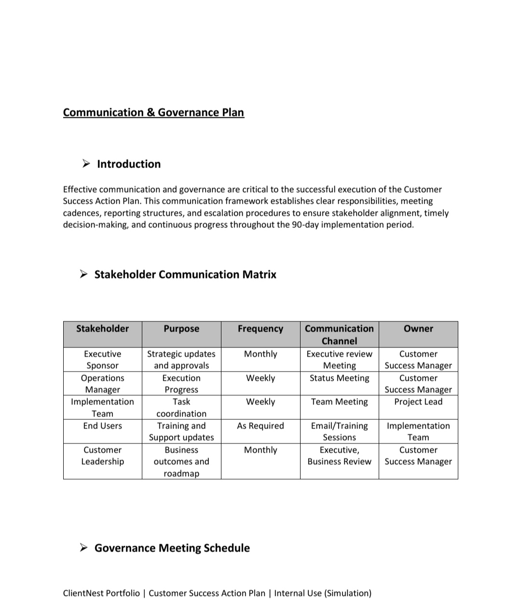

# 📋 ClientNest – Customer Success Action Plan (CSAP)

## Overview

This repository contains a simulated **Customer Success Action Plan (CSAP)** developed for Apex Diagnostics as part of the ClientNest Customer Success Portfolio.

The document demonstrates how Customer Success teams translate customer health insights into structured execution plans through governance, KPI monitoring, stakeholder communication, risk mitigation, and operational improvement initiatives.

---

## Business Objective

Following the Customer Health Assessment, Apex Diagnostics required a structured 90-day action plan to improve CRM adoption, increase customer engagement, reduce operational risks, and strengthen executive alignment.

---

## Key Deliverables

- 90-Day Customer Success Action Plan
- Executive Dashboard
- KPI Monitoring Framework
- CRM Adoption Strategy
- User Enablement Plan
- Risk Register & Mitigation Plan
- Communication & Governance Framework
- Review & Approval Process

---

# Project Preview

## Executive Summary

---

## CSAP Overview

---

## Executive Dashboard

---

## Detailed Action Plan

---

## KPI Dashboard

---

## Communication & Governance

---

# Document

📄 Customer_Success_Action_Plan.pdf

---

# Skills Demonstrated

- Customer Success
- Business Operations
- Strategic Planning
- KPI Monitoring
- Executive Reporting
- Stakeholder Management
- CRM Adoption Strategy
- Process Documentation
- Risk Assessment
- Cross-functional Collaboration

---

## Author

**Dipanjan Mondal**

Customer Success | Business Operations | Process Improvement

LinkedIn: https://www.linkedin.com/in/dipanjan-mondal07/

GitHub: https://github.com/DipanjanMondal7
